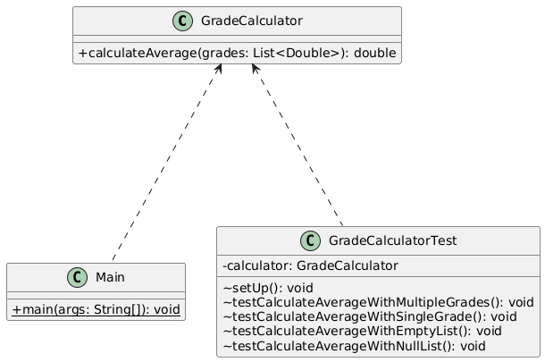

# Student Grade Calculator

This project is an implementation of a simple `GradeCalculator` in Java, developed as part of an individual assignment. The primary goal is to demonstrate a high-quality design, clean code, and thorough testing while adhering to strict coding standards.

## 1. Specification

The program is required to compute the average of a list of grades. The core requirement is to isolate the calculation logic from any input/output (I/O) or data persistence operations, such as reading from a file or printing to the console. The calculator should accept a list of numbers and return their average.

## 2. Architecture and Design

The design is centered around the **Single Responsibility Principle (SRP)**. The diagram below illustrates this structure.

* **`GradeCalculator.java`**: This class has only one reason to change: the algorithm for calculating the average. It is completely decoupled from how data is obtained or displayed.
* **`Main.java`**: This class acts as a client or consumer of the `GradeCalculator`. Its responsibility is to prepare data and display the results, demonstrating how the calculator can be used in a larger application.
* **`GradeCalculatorTest.java`**: This class is responsible for verifying the correctness of the `GradeCalculator`.

This separation ensures the core logic is reusable, maintainable, and easy to test in isolation.

## 3. Implementation

The implementation uses standard Java features. A `List<Double>` is used to hold the grades, offering flexibility. The `calculateAverage` method includes guard clauses to handle invalid inputs (null or empty lists) by throwing an `IllegalArgumentException`. This makes the class robust and communicates errors clearly to the calling code. The code is documented with Javadoc comments to improve clarity.

## 4. Testing

[cite_start]Unit testing was performed using **JUnit 5**, as required[cite: 8]. The test suite in `GradeCalculatorTest.java` covers:
* A typical success scenario with multiple grades.
* An edge case with a single grade.
* Failure scenarios for both `null` and empty lists.

The tests ensure the calculator is reliable and behaves as expected under various conditions.

## 5. Documentation

* **In-Code Documentation**: All public classes and methods are documented using Javadoc comments, explaining their purpose, parameters, and return values.
* **Project Documentation**: This `README.md` file serves as the primary documentation for the project, detailing its design, implementation, and testing strategy.